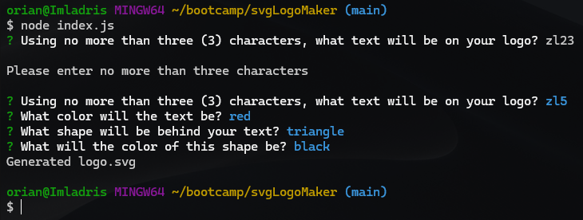

# SVG Logo Maker
  

  

## Description
  

This application is designed so a user can quickly generate a simple logo so they do not have to pay a graphic designer.  The user simply enters text up to three (3) characters long, enters the color of the text, selects one of three shapes, then finally enters the color of the shape.  The logo will be generated in svg format and can be copied and utilized as needed.
  

## Table of Contents
  

- [Installation](#installation)
  
- [Usage](#usage)
  
- [License](#license)
  
- [Contributing](#contributing)
  
- [Tests](#tests)
  
- [Questions](#questions)
  

## Installation
  

The app requires that the respository be cloned to the local machine prior to use.
  

## Usage
  

To use the application, navigate to the respository in a terminal and invoke the application by typing "node index.js".  The user will be asked four questions to obtain the following information for the logo: the text of the logo, the color of this text, the shape that will appear behind the text, and the color of the shape.  There a a few things to note.  First, the text can be no more than three (3) characters long.  If more are entered, the application will alert the user and the user will be prompted to enter the text again.  At this point, the application cannot verify colors.  The user can use either color keywords or hexidecimal numbers; however, if there are any typos in the entry of the colors, the application will not render the svg file properly.  The user is encouraged to check their responses to the color questions before hitting the enter key.  The logo will generate in a file named "logo.svg" which will be saved to the "examples" folder of the repository.  All logos have a width of 300 pixels and a height of 200 pixels.

A video demonstration of this application can be viewed at https://drive.google.com/file/d/14R6PkeB4koUpAoLryeYxdsPYrQzEgtQg/view

The repository for this application can be viewed at https://github.com/orian42/svgLogoMaker.

Examples of logos created with this application:

  

## License
  

This application is operating under the following license: **MIT License**.  
  

Further information regarding this license, to include the required notice, can be read by navigating to the following link: https://opensource.org/licenses/MIT.
  

## Contributing
  

Others wishing to contribute to the project can contact me through the contact information below.
  

## Tests
  

The following screenshot demonstrates the testing of this application.

  

## Questions
  

Any questions regarding this project can be answered by contacting me through my GitHub profile or by email:
  
GitHub Profile: https://github.com/orian42
  
email: orian42@gmail.com
